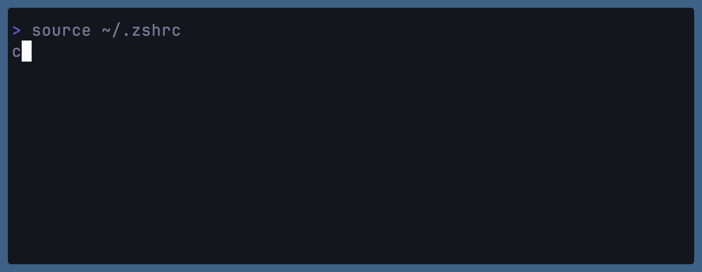
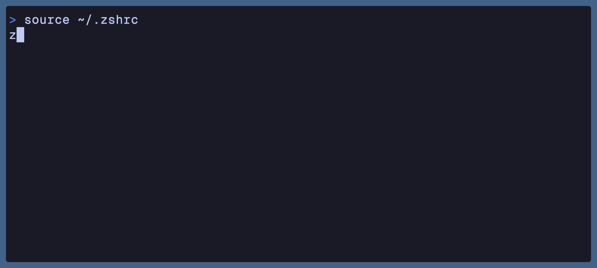
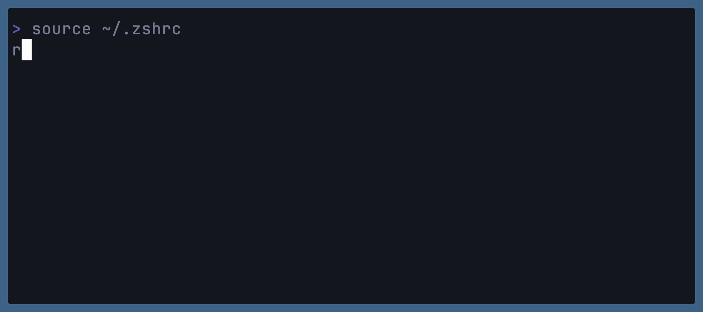
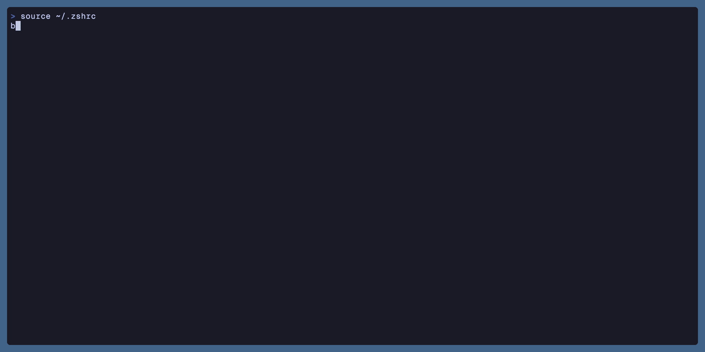
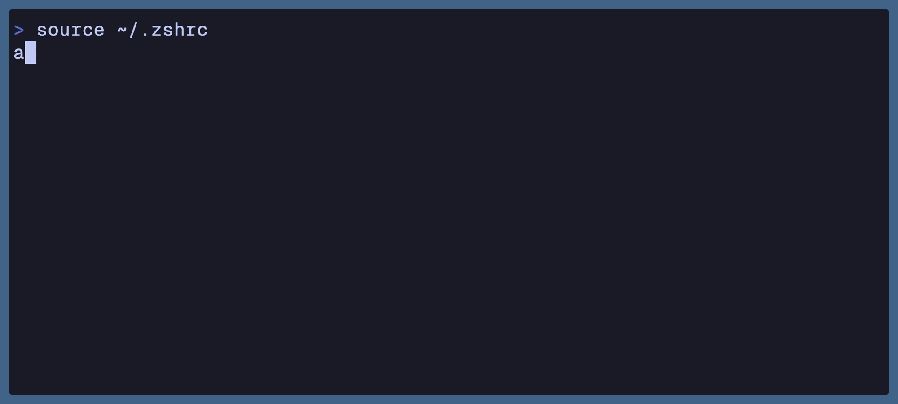
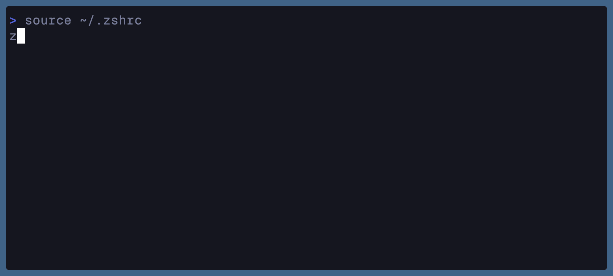
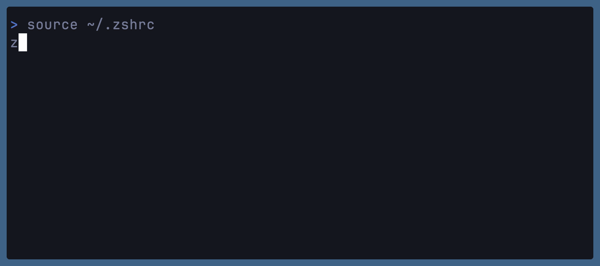
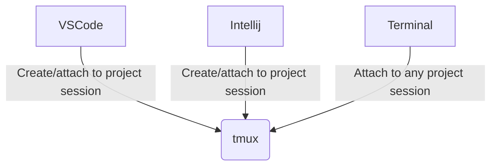

# Mastering Your Terminal

Efficient Tools & Portable Setups

<!--
The last comment block of each slide will be treated as slide notes. It will be visible and editable in Presenter Mode along with the slide. [Read more in the docs](https://sli.dev/guide/syntax.html#notes)
-->

---
layout: two-cols
---

<div class="flex flex-col items-center space-y-2 mt-20" v-clicka>
  
  <h2>Jan Biasi</h2>
  <p>Software Engineer</p>
  <div class="grid grid-cols-4 items-center gap-1 opacity-70">
    
    
    <carbon:logo-react class="h-8" />
    <carbon:logo-github class="h-8" />
  </div>
</div>

::right::

<div class="mt-16" v-click>
  <h3>Working at</h3>
  <p class="text-md opacity-70">
    St.Galler Kantonalbank AG
    <br />
    seekme.io
  </p>
  <h3 class="mt-8 my-4">OpenSource</h3>
  <ul class="opacity-70 text-md mb-0">
    <li>
      <a href="">Rollup Plugin SBOM</a>
    </li>
    <li>
      <a href="">Payload CMS</a>
    </li>
    <li>
      <a href="">Coolify</a>
    </li>
    <li>
      <a href="">Commitlint</a>
    </li>
  </ul>
  <span class="text-xs opacity-50 my-1">... and more</span>
</div>

---
hideInToc: true
---

# Agenda

## Your Prompt

- Improve your statusline with starship

## Terminal Tools

- Better alternatives to 90s tools
- General essentials for everyone
- Terminal workflow tools

## Portability

- Symlink configurations with `stow`

---
layout: two-cols
---

# Your prompt


::right::

<br />
<br />

View important information (i.E. git status, runtime stats, ...) at a glance.

Bonus: it also looks just good! My personal favorite is [starship](https://starship.rs/) _(written in rust btw)_.

Considerable alternatives:

- [oh my zsh](https://github.com/ohmyzsh/ohmyzsh)
- [powerlevel10k](https://github.com/romkatv/powerlevel10k)
- [oh my posh](https://ohmyposh.dev/)

---
layout: fact
---

# Better alternatives

---

# Better alternatives - bat

A cat(1) clone with syntax highlighting and Git integration.

<v-click>
  
</v-click>

https://github.com/sharkdp/bat

---

# Better alternatives - eza

Modern alternative to `ls`, including git status, hyperlinks, relative dates amm.

<v-click>
  
</v-click>

https://github.com/eza-community/eza

---

# Better alternatives - ripgrep

- Better `grep`
- Best in combination with fzf

<v-click>
  
</v-click>

https://github.com/BurntSushi/ripgrep

---

# Better alternatives - btop

Resource monitor that shows usage and stats for processor, memory, disks, network and processes.
Easy on the eyes, clear layout and great DX compared to i.E. top/htop/...

<v-click>
  
</v-click>

https://github.com/aristocratos/btop

---

# Better alternatives - atuin

Searchable history with deduplication and options to remove sensitive information.<br />
You may also deploy your own history sync server via docker.

You should probably use atuin if you're hitting the <kbd>&#8593;</kbd> key a lot 😅

<v-click>
  
</v-click>

https://atuin.sh

---
layout: fact
---

# Essentials

---

# Essentials - fzf

- interactive filter program for any kind of list;
- implements a "fuzzy" matching algorithm
- barebone for a lot of other tools

<v-click>
  
</v-click>

https://github.com/junegunn/fzf

---

# Essentials - zoxide

- Smarter `cd` inspired by z and autojump
- Can integrate with `fzf` by using `zi`
- Remembers where you were (used for priorization)

<v-click>
  
</v-click>

https://github.com/ajeetdsouza/zoxide

---

# Essentials - jq

Command line JSON processor

<v-click>
  
</v-click>

https://github.com/jqlang/jq

---

# Essentials - yazi

- File manager in your terminal
- Built in code preview and syntax highlighting
- Integration with ripgrep, fd, fzf and zoxide

<v-click>
  
</v-click>

https://github.com/sxyazi/yazi

---
layout: fact
---

# Terminal Workflow

---
layout: two-cols
---

# Terminal Workflow - tmux

Cross-platform terminal mulitplexer<br />with many opinions.

What I love about tmux

- Keyboard controlled by default
- Session management options
- Detaching and attaching
- Resurrection of sessions
- Rich ecosystem
- Terminal emulator agnostic
- Pane splitting and navigation

https://github.com/tmux/tmux

::right::

<br />
<br />
<Tweet id="1816917778202505288" conversation="full" scale="0.8" />

<!--
- You can detach anytime for background processes
- Create multiple sessions, and persist them accross reboots
- There's a plugin for everything
- Great when SSH'ing into a server to prevent locking your connection
- Want to switch your terminal emulator? No problem, you don't need to learn new keybindings
-->

---

# Terminal Workflow - tmux example



https://github.com/tmux/tmux

---

# Terminal Workflow - tmux + sesh

- Tmux session manager with `fzf` integration
- Raycast companion extension
- Uses zoxide for most recent sessions


https://github.com/joshmedeski/sesh

---

# Terminal Workflow - tmux + editors

<br />
<br />



<!--
- Configure your editor to create or attach to tmux session with project name
- Use sesh to attach to the session from anywhere
-->

---
layout: fact
---

# Workflow Demo

---
layout: fact
---

# Portability

---
layout: two-cols
---

# Why portability matters

<v-clicks>

## Cases

- More than 1 computer
- Computer dies
- Device gets stolen
- OS update bricks computer
- Misconfiguration

## Outcome

- Projects are save via SCM
- Usually no personal data lost
- Loss of apps & devtools
- Loss of lots of configurations

</v-clicks>

::right::

<div class="mt-10" />

<v-clicks>

## Classic recovery

- Re-download all apps (~30min)
- Reconfigure your OS (~30min)
- Reconfigure your shell (~1h)
- Reconfigure your tools (~1h)
- Fix things you forgot to setup (endless)

## Portable setup recovery

- Pull apps from your lockfile (~1min)
- Sync OS settings (~5s)
- Sync configuration files (~5s)

</v-clicks>

---

# Understanding configuration places

Nearly all terminal tool configurations live under `~/.config`, except:

- GUI tools on macOS under `~/Library/Application Support/<appname>/`
- GUI tools on Windows under `%APPDATA%\<appname>\`

Shell configurations depend on which shell you are using:

- Bash in `~/.bashrc` and `~/.bashprofile`
- ZSH in `~/.zshrc` and `~/.zprofile`
- Fish in `~/.config/fish/conf`

Useful resources:

- [XDG base directory specification](https://specifications.freedesktop.org/basedir/latest)
- [macOS service configurations](https://support.apple.com/de-ch/guide/deployment/depdac2c8d89/web)

---

# Dotfile management with stow - setup

GNU Stow is a symlink manager, which helps symlinking all configurations to the appropriate locations.

- Install `stow` on non-linux computers
- Create a new folder like `.dotfiles` in your home
- Push the folder to a github repository
- Keep track of changes

<br />

```sh
~/.dotfiles
  + .config/
  |  + tmux/
  |  |  + tmux.conf
  + Application Support/Code/User
  |  + settings.json
  + .gitconfig
  + .zshrc
```

---

# Dotfile management with stow - result

Sync your files incrementally via

```sh
stow -v --restow --adopt .
```

And see the result

```sh
$HOME/
  + .config/
  |  + tmux/
  |  |  + tmux.conf # => ~/.dotfiles/.config/tmux/tmux.conf
  + Application Support/Code/User
  |  + settings.json # => ~/.dotfiles/Application Support/Code/User/settings.json
  + .gitconfig # => ~/.dotfiles/.gitconfig
  + .zshrc # => ~/.dotfiles/.zshrc
```

---

# Dotfile management - stow alternatives

- `nix` with home manager (limited on darwin)
- `chezmoi`
- `ansible`
- `yadm`
- `dotter`
- ... probably more

---

# What next?

- Dig through your configurations
- Cleanup obsolete content
- Inject env secrets via a PW manager (like 1Password's `op` CLI)
- Dump your installed software (like `brew bundle dump` or `pacman -Qqe > pkgs.txt`)
- Add some OS configuration scripts - don't do it in the UI
- Make it convenient, use a tool like `make` to orchestrate

---
layout: fact
---

# Recap

---

# tl;dr

- this is a personal take
- use a prompt like `starship`
- modern native replacements: `bat`, `ripgrep`, `eza`, `btop`
- essentials: `jq`, `zoxide`, `yazi`
- use `tmux` - learn once, use everywhere
- backup your dotfiles, use `stow` for symlinking
- orchestrate management with a tool like `make`
- record your terminal for talks with [<kbd>vhs</kbd>](https://github.com/charmbracelet/vhs)

<div class="h-24" />

<div class="text-sm opacity-70">
  My personal dotfiles:<br />
  <a href="https://github.com/janbiasi/.dotfiles">https://github.com/janbiasi/.dotfiles</a>
</div>

---
layout: fact
---

# Thanks!

<p class="opacity-50">
  Questions?
</p>
