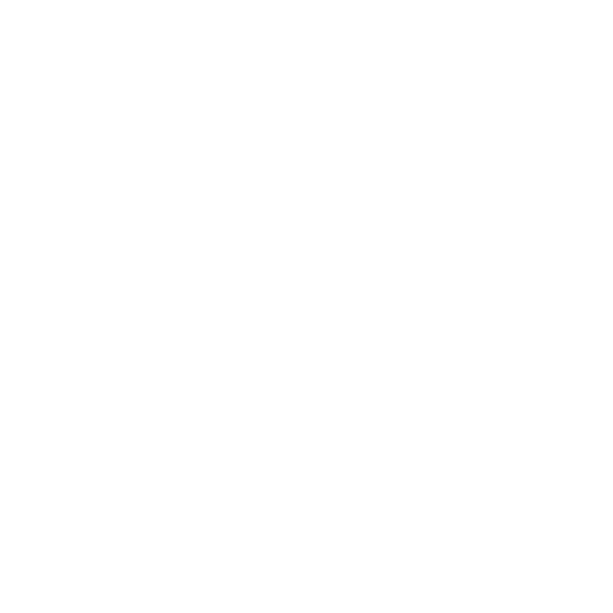
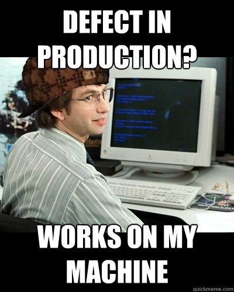

# Reproducible Development Environments

Works not only on my machine ;)

---
layout: two-cols
---

<div class="flex flex-col items-center space-y-2 mt-20" v-clicka>
  
  <h2>Jan Biasi</h2>
  <p>Software Engineer</p>
  <div class="grid grid-cols-4 items-center gap-1 opacity-70">
    
    
    <carbon:logo-react class="h-8" />
    <carbon:logo-github class="h-8" />
  </div>
</div>

::right::

<div class="mt-16" v-click>
  <h3>Working at</h3>
  <p class="text-md opacity-70">
    St.Galler Kantonalbank AG
    <br />
    seekme.io
  </p>
  <h3 class="mt-8 my-4">OpenSource</h3>
  <ul class="opacity-70 text-md mb-0">
    <li>
      <a href="">Rollup Plugin SBOM</a>
    </li>
    <li>
      <a href="">Payload CMS</a>
    </li>
    <li>
      <a href="">Coolify</a>
    </li>
    <li>
      <a href="">Commitlint</a>
    </li>
  </ul>
  <span class="text-xs opacity-50 my-1">... and more</span>
</div>

---
hideInToc: true
---

# Agenda

- How do you manage project setups?
- "Works on my machine"
- Solutions: Dev Containers, mise, nix / devenv / devbox
- What makes Nix special
- Comparison & Tradeoffs
- Example: Next.js + Postgres + Redis in one file
- Ad-hoc shells via nix
- Related Tooling (direnv, secretspec)

## Recommendation

- When to use what

---
layout: left
---

# How do you manage project setups?

- `README.md`
- Dev Containers
- Mise
- Nix (shell, devenv, devbox)
- Others?

---
layout: statement
---



<a href="https://www.freecodecamp.org/news/why-it-worked-on-my-machine-still-happens-in-2026" class="text-xs">
    Why "it worked on my machine" still happens in 2026
</a>
<p className="text-[9px] opacity-50">
    Source: 
    <a href="https://medium.com/@saada/why-it-still-works-on-my-machine-in-2016-97ef31977469">
        https://medium.com/@saada/why-it-still-works-on-my-machine-in-2016-97ef31977469
    </a>
</p>

---

# Available Solutions

- **Dev Containers** — IDE-integrated, container-based
- **mise** — Unified tool and service version manager
- **devbox** — Nix as JSON config, managed (by Jetify)
- **devenv** — Nix-based, simplified DX (by Cachix, major Nix contributor)
- **Raw Nix** — `shell.nix`; full power with max. complexity

---
layout: two-cols
---

# But what is Nix?

- **Functional package manager** — same inputs always produce same outputs
- **Separate storage** — packages live in `/nix/store`, isolated from system
- **Immutability** — packages never change in place, new versions = new paths
- **No sudo for packages** — install tools without elevated privileges (daemon handles permissions)
- **Atomic upgrades** — roll back to any previous version instantly

::right::

<span class="block mt-11" />

```bash
/nix/store/
├── abc123-nodejs-18.12.1/
├── def456-postgresql-15/
├── ghi789-redis-7.0/
└── jkl012-nodejs-20.0/
```

Each package is isolated. Multiple versions coexist peacefully.

Registry: https://search.nixos.org/packages

---
layout: center
---

# Comparison

| Tool           | Languages | Services                             | Reproducibility | Learning Curve                         | Resource Overhead                       | Packages |
| -------------- | --------- | ------------------------------------ | --------------- | -------------------------------------- | --------------------------------------- | -------- |
| Dev Containers | ✅        | ✅                                   | Medium          | Low                                    | <span class="text-red-400">High</span>  | ~4M      |
| mise           | ✅        | <span class="text-red-400">❌</span> | Low             | Low                                    | <span class="text-green-400">Low</span> | ~6k      |
| devbox         | ✅        | ✅                                   | High            | Medium                                 | <span class="text-green-400">Low</span> | ~100k    |
| **devenv**     | ✅        | ✅                                   | High            | Medium                                 | <span class="text-green-400">Low</span> | ~120k    |
| Raw Nix        | ✅        | ✅                                   | Very High       | <span class="text-red-400">High</span> | <span class="text-green-400">Low</span> | ~140k    |

---

# Dev Container Limitations

- Heavy resource usage (Docker on macOS)
- Slow startup times
- IDE lock-in (VS Code / JetBrains)
- Docker Desktop licensing costs
- Still need to manage versions inside the container

> You get isolation, but at a cost: RAM, CPU, and disk space for every project.

---

# Mise Limitations

- Only manages language runtimes
- No services built-in (Postgres, Redis, etc.)
- No isolation between projects
- Global pollution
- Shims can cause subtle issues
- ARM workarounds sometimes needed

> Great for version management, but you still need Docker Compose for services.

---

# Nix / Devbox / Devenv Limitations

- Steep learning curve (Nix language syntax)
- Slow first builds / large downloads
- Manual garbage collection (old generations pile up)
- Debugging Nix errors is painful
- Not every package in nixpkgs
- Flake schema still evolving (devenv/devbox abstract this, but leaky)

> Powerful, but the Nix ecosystem demands patience and disk space.

---
layout: two-cols
---

# mise: What You Get

## Works great for:

- ✅ SDK versions (like Node.js)
- ✅ Smaller stacks
- ✅ Simple tasks

## But what about...

- ❌ Services like PostgreSQL, Redis, ...
- ❌ Process composition
- ❌ Integrating secret managers

::right::

<span class="block mt-11" />

```toml
# mise.toml
[tools]
node = "18.12.1"
python = "3.11.2"

[tasks.build]
description = "Build the app"
run = "npm run build"
```

> **Reality:** You still need Docker Compose or manual installs for services.

---
layout: two-cols
---

# devbox

- Node.js 26
- PostgreSQL 18 with PgVector
- Integrates [process compose](https://f1bonacc1.github.io/process-compose/)
- Environment variables via [direnv](https://direnv.net/)
- No Docker overhead at all
- Reproducible across machines
- Autoloading shell in any editor
- More "best of breed" approach
- Auto-activation on `cd`

::right::

```jsonc
// devbox.json
{
  "$schema": "https://raw.githubusercontent.com/jetify-com/devbox/0.17.5/.schema/devbox.schema.json",
  "packages": ["go@1.26.5", "postgresql@18.4", "postgresql18Packages.postgis@3.6.4"],
}
```

```yaml
processes:
  db-init:
    command: |
      until pg_isready -q; do sleep 1; done
      if ! psql -d postgres -tAc "SELECT 1 FROM pg_database WHERE datname = 'example-db'" | grep -q 1; then
        createdb example-db
      fi
      psql -v ON_ERROR_STOP=1 -d example-db <<'SQL'
      CREATE EXTENSION IF NOT EXISTS pgvector;
      SQL
    depends_on:
      postgresql:
        condition: process_started

  app:
    command: go run main.go
    depends_on:
      postgresql:
        condition: process_started
```

---
layout: two-cols
---

# devenv

- Node.js 26
- PostgreSQL 18 with PgVector
- Redis
- Process management and composition
- Environment variables via [direnv](https://direnv.net/)
- Secrets via [secretspec](https://secretspec.dev/)
- No Docker overhead at all
- Reproducible across machines
- Autoloading shell in any editor
- Git hooks (via [pre-commit](https://pre-commit.com/))
- Devbox is similar, but in JSON
- Auto-activation on `cd`

::right::

```nix
# devenv.nix
{ pkgs, config, ... }: {
  dotenv.enable = true;
  env.MY_KEY = config.secretspec.secrets.MY_KEY or "";

  packages = [nodejs_26, jq];

  git-hooks.hooks.eslint.enable = true;

  languages.javascript.enable = true;
  languages.javascript.pnpm.enable
  languages.javascript.package = pkgs.nodejs_26;

  services.postgres.enable = true;
  services.postgres.package = extensions.pgvector_18;
  services.postgres.initialDatabases = [{ name="app"; }];

  services.redis.enable = true;

  processes = {
    "nextjs".exec = "pnpm dev";
    "nextjs".after = ["devenv:processes:postgres"];
  };
}
```

---
layout: two-cols
---

# nix ad-hoc

- Run a single command (`nix run`)
- Temporary shell with packages (`nix-shell`)
- Useful to i.E. use an older `psql` package or try out a new fancy AI tool

::right::

<span class="block mt-11" />

```sh
# execute once - fire and forget
nix run nixpkgs#fastfetch

# temporary disposable shell with packages
nix-shell -p postgresql_16
psql --version
# psql (PostgreSQL) 16.14

exit
psql --version
# zsh: command not found: psql
```

---
layout: two-cols
---

# When to Use What

### Simple Projects

_Single language, no services_

→ **mise or devbox**

### Complex Projects

_Multiple services, complex setups_

→ **devenv**

### Ad-hoc tools and trials

_Try new/old tools in a one-off task_

→ **nix-shell** / **nix run**

::right::

<span class="block mt-11" />

### Maximum Control

_Custom build logic, system packages_

→ **shell.nix** (raw)

### IDE-First Teams

_Everyone uses VS Code / JetBrains and has enough RAM/CPU_

→ **Dev Containers (or devenv)**

---
layout: two-cols
---

# Related: direnv

Auto-load your environment when entering a directory.

- Follow 12factor app best practices
- No more `source .env`
- No more manual activation
- Works with any shell
- Seamless integration with devenv/devbox/mise

::right::

<span class="block mt-11" />

```bash
# .envrc with devenv
use devenv

# with devbox
devbox generate direnv
```

---
layout: two-cols
---

# Related: secretspec

Manage secrets in reproducible environments.

- Define secrets schema in code
- Inject into devenv/nix environments
- Different secrets per environment
- Never commit actual secrets
- Variable backends (i.E. vault, infisicial, 1password amm.)
- Mise launched it's own tool [fnox](https://github.com/jdx/fnox) recently (not as complete and agnostic)

::right::

<span class="block mt-11" />

```yaml
# secretspec.yaml
secrets:
  DATABASE_URL:
    description: "Postgres connection"
  REDIS_URL:
    description: "Redis connection"
```

---

# tl;dr

- There are more tools than devcontainers
- Give the nix ecosystem a try
- Adopt direnv to follow 12factor app best practices

<br />

```bash
# Install devenv
curl -fsSL https://devenv.sh/install.sh | sh

# Initialize in your project
devenv init

# Enter the environment
devenv shell
```

---
layout: fact
---

# Thanks!

<p class="opacity-50">
  Questions?
  <br />
  <span class="opacity-50 text-xs">
    Slides available at
    <a href="https://janbiasi.github.io/talks">
    https://janbiasi.github.io/talks
    </a>
  </span>
  <br />
  <span class="opacity-50 text-xs">
    Examples available at
    <a href="https://github.com/janbiasi/nix-demos">
        https://github.com/janbiasi/nix-demos
    </a>
  </span>
</p>

---

# Resources

- https://devenv.sh
- https://www.jetify.com/devbox
- https://nixos.wiki/wiki/flakes
- https://direnv.net
- https://secretspec.dev
- https://mise.jdx.dev
- https://fnox.jdx.dev
